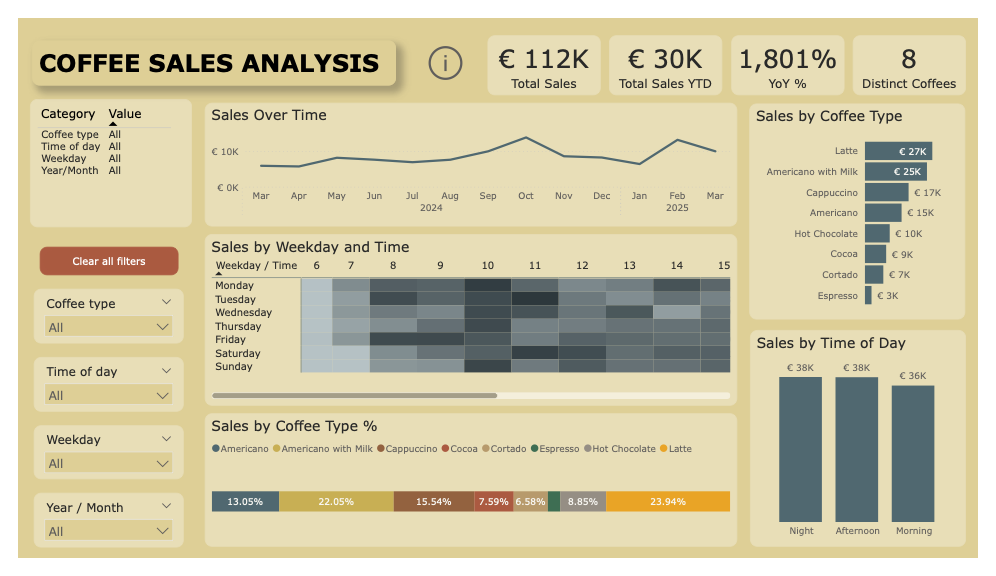
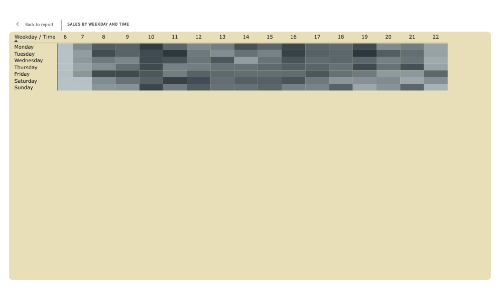
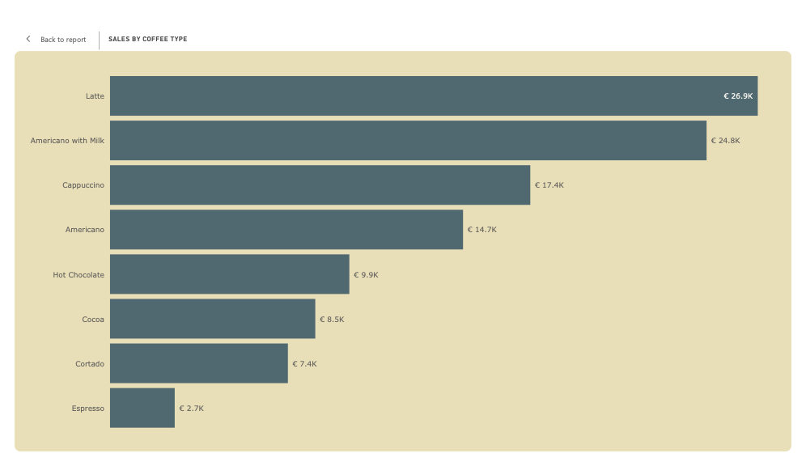

# Coffee Sales Analysis

This project analyzes coffee shop sales data using **PostgreSQL** for storage and transformation, and **Power BI** for interactive reporting.

## Features

- **Database setup**
  - Staging and analytics schemas
  - Typed fact table with transformations
  - Indexing for performance
  - Views for clean Power BI consumption ([SQL script](coffee_sales_db%20code.sql))

- **Power BI Dashboard** ([PBIX file](Coffee%20Sales%20Analysis.pbix))
  - KPIs (Total Sales, YTD Sales, YoY %, Distinct Coffees)
  - Sales trends over time
  - Top coffee products
  - Weekday × hour heatmap
  - Composition by payment type and time of day
  - Flexible slicers (Year/Month, Coffee Type, Time of Day, Weekday)

- **Documentation**
  - [Dashboard preview (PDF)](Default%20view%20dashboard.pdf)

## Project Goals

- Demonstrate end-to-end analytics workflow (PostgreSQL → Power BI)
- Optimize SQL for minimal transformations, keeping business logic in Power BI
- Provide insights into customer purchasing patterns and product performance

## Data

A small sample dataset is included for testing and demonstration:

- `data/sample_data.csv` → Example dataset (100 rows) matching the schema of `staging.coffee_sales_raw`.

To use it:
1. Open pgAdmin → Import Data wizard.
2. Target table: `staging.coffee_sales_raw`.
3. File: `data/sample_data.csv` (CSV, UTF-8, header row).
4. Run the provided SQL script to transform and load into `analytics.coffee_sales`.

## Dashboard Preview

The Power BI dashboard provides multiple perspectives on coffee sales performance.  
Below are example pages with key insights:

### Main Dashboard
Overall view of KPIs, including Total Sales, YTD Sales, YoY %, and Distinct Coffees.

### Heatmap (Weekday × Hour)
Visualizes demand patterns across weekdays and hours, highlighting peak sales periods.

### Top Coffees
Ranks coffee products by sales volume and revenue share, identifying best performers.

## Files

- `coffee_sales_db code.sql` → Database schema, ETL, indexes, views  
- `Coffee Sales Analysis.pbix` → Power BI dashboard  
- `Default view dashboard.pdf` → Dashboard preview (PDF version)  
- `data/sample_data.csv` → Example dataset  
- `screenshots/*.png` → Dashboard screenshots  

## Getting Started

1. Run SQL script in PostgreSQL to create tables, load data, and build views.  
2. Import `data/sample_data.csv` into `_
